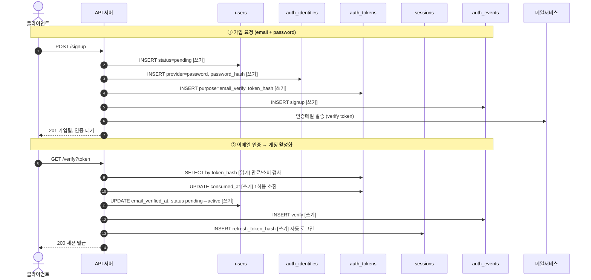

# ERD · 기능 데이터 흐름 (데이터 모델링 방법론)

> **스코프 메모**: 이 내용은 `dakman-brain`(사업 구상·메타관리 위키 — 개발 안 함)에서 탐색했으나, **개발 방법론**이므로 `dakman-setup` 소관이다. 여기서 이어간다.
> **워크플로우 위치**: SDD(문서→디자인→소스)의 **기획·설계 단계** 산출물. 기능 구현 전에 "관련 테이블 + 데이터 흐름"을 확정한다. `{위험도메인}`(workflow.md §0)이 DB면 Tier 상향.

---

## 1. 두 개의 뷰 (구조 ⊥ 흐름)

기능 개발에 필요한 건 **두 가지 다른 그림**이다. 정적 ERD 하나로는 "데이터가 어떻게 흐르는가"를 표현 못 한다.

| 뷰 | 무엇 | 도구(diagram-as-code) |
|----|------|----------------------|
| **구조 (ERD)** | 어떤 테이블·컬럼·관계가 있나 (정적) | **DBML** |
| **기능 데이터 흐름** | 그 기능 실행 시 어떤 테이블을 **어떤 순서로 읽기/쓰기** + 상태 전이 (동작) | **Mermaid 시퀀스** |

둘은 **다른 뷰, 같은 스키마**. 테이블명만 공유하고 스키마를 재정의하지 않으므로 드리프트가 없다.

---

## 2. 핵심 설계 원리 (AIDD 스키마)

**명사는 사람이(설계), 동사는 AI가(레일 위에서).** AI는 본성이 로컬(지금 보는 기능만)이라 글로벌 정합이 필요한 스키마를 통째로 맡기면 같은 개념이 여러 곳에 중복 모델링된다. 스키마 레이어만은 사람이 위에서 설계하고 AI는 비평가로 쓴다.

1. **비가역성 비대칭** — 코드는 `git revert`로 되돌아오지만 데이터는 아니다. 그래서 스키마/마이그레이션엔 게이트(사람 검토)가 정당하고, 기능 코드는 싸니까 AI가 자유롭게.
2. **명사 먼저** — 기능 명세 전에 안 변하는 핵심 엔티티 5~7개를 못박는다.
3. **core / edge 분리** — core(정체성·결제 등: 정규화·신중) vs edge(로그·이벤트·캐시: append-only·휘발성, AI 자유). 같은 엄격함을 둘에 다 쓰지 않는다.
4. **모르면 정규화된 Postgres** — 1인 빌더는 제품을 아직 모름 → 정규화 관계형이 "예상 못 한 질문"까지 여는 최대 가역성. 비정규화는 측정 후.
5. **단일 진실의 출처** — 사실 하나당 권위 테이블 하나. 나머지는 파생(캐시·비정규화 읽기), **항상 재계산 가능**해야 함. 두 곳에 살면 드리프트=사고.
6. **상태기계** — `status` 같은 생애주기는 허용된 전이만(기능마다 자유롭게 찌르지 않음).
7. **제약 = AI가 못 깨는 가드레일** — FK·unique·check·not null. 기능 코드가 틀려도 DB가 막음.
8. **soft delete = 가역성** — 삭제는 행 제거가 아니라 `status=deleted` + `deleted_at`.
9. **마이그레이션은 forward-only·additive** — rename·mutate 대신 추가→이중기록→폐기.
10. **쓰기 경로 ≠ 읽기 경로** (CQRS-lite, 머릿속 분리). 토큰류는 **해시만 저장**(원문 금지).

---

## 3. 에이전트 주도 툴체인 (diagram-as-code — GUI 금지)

**기준: Claude가 CLI/텍스트로 단독 구동 가능한가.** DrawDB·ChartDB 같은 브라우저 GUI는 클릭·드래그가 필요해 *에이전트가 주도 불가 + 세션 컨텍스트 단절* → 쓰지 않는다. (배경: dakman-brain 메모리 `agent-driven-no-manual-gui`)

| 작업 | 입력 | 명령 | 출력 |
|------|------|------|------|
| ERD 그림 | `.dbml` | `npx --yes @softwaretechnik/dbml-renderer -i x.dbml -o x.svg` | 오프라인 SVG (viz.js 번들, 의존성 0) |
| SQL DDL | `.dbml` | `npx --yes -p @dbml/cli dbml2sql x.dbml --postgres -o x.sql` | PostgreSQL DDL |
| 기능 흐름 | `.mmd` | `mmdc -i x.mmd -o x.svg -b white --puppeteerConfigFile pptr.json` | 오프라인 SVG |
| 뷰 패키징 | SVG | HTML에 인라인 | 자립형 HTML (외부 CDN 0) |

**알아둘 함정 (실측):**
- `@dbml/cli`는 바이너리명이 따로라 `npx -p @dbml/cli dbml2sql ...`로 호출 (`npx @dbml/cli`는 실패).
- **DBML `-`(1:1) 피연산자 순서 = FK 방향.** `Ref: A - B`는 FK를 B에 건다. 자식(FK 보유)이 두 번째 피연산자가 되게 써야 함. (예: 프로필이 유저에 종속이면 `Ref: users.id - user_profiles.user_id` → FK가 user_profiles에. 반대로 쓰면 "모든 유저가 프로필 강제 + insert 닭-달걀" 버그.)
- **mmdc는 puppeteer chromium 필요** → 다운로드 대신 **시스템 Chrome 재사용**으로 마찰 제거. `pptr.json`:
  ```json
  { "executablePath": "/Applications/Google Chrome.app/Contents/MacOS/Google Chrome", "args": ["--no-sandbox"] }
  ```
  (더 단단히 하려면 `npx puppeteer browsers install chrome`로 헤드리스 chromium 설치해 자기완결화 — 미결정.)

---

## 4. `/erd` 스킬 계획 (다음 작업 — 미구현)

이 파이프라인을 **글로벌 `/erd` 스킬**로 정본화한다. 입력은 자연어 한 줄, 나머지는 에이전트가 전부 CLI로.

| 사용자 요청 | 스킬이 하는 일 |
|---|---|
| "회원가입 스키마 만들어" / "payments 테이블 추가" | `.dbml` 편집 → `dbml2sql`(SQL) + `dbml-renderer`(ER HTML) 재생성 |
| "회원가입 **기능 흐름** 그려" / "비번 재설정 흐름" | `<기능>.mmd`(Mermaid 시퀀스) 작성 → `mmdc`(흐름 HTML) |
| "비번 재설정이 어떤 테이블 건드려?" | 그 기능 흐름도에서 관련 테이블·읽기/쓰기 추출 |

- **단일 출처**: 스키마는 `.dbml` 하나. 흐름도는 테이블명만 참조.
- **산출물**: `.sql` · ER `.html` · 기능별 flow `.html` — 자립형(CDN 0).
- **미결정**: ① 렌더러 robustness(시스템 Chrome vs 헤드리스 chromium) ② D2를 더 예쁜 렌더 타깃으로 추가할지 ③ 진짜 DB 생기면 `tbls`로 실 DB→ERD 자동생성 endgame.

---

## 5. 워크플로우 / 프로젝트 연결

- **SDD 단계**: 기획(엔티티 도출)→디자인(ERD+흐름 확정)→구현. 산출물은 `artifacts/planning/`(architecture.md 옆) 또는 `artifacts/design/`에 배치.
- **Tier**: DB가 `{위험도메인}`이면 스키마/마이그레이션 변경은 Tier 상향(검토 강화).
- **maker-checker**: ERD/흐름은 designer 산출 → design-reviewer 검토 대상에 포함.
- **위키 연동**: 이 방법론·결정은 `wiki-ingest: {status: pending}` 마커 달면 develop 머지 시 LLM 위키로 ingest (project-init.md §9). 단 vault 밖 소스 문서에만.

---

## 6. 워크드 예시 — 회원가입 (signup)

dakman-brain 탐색에서 만든 샘플. 그대로 가져와 이어 쓰면 됨.

### 6.1 스키마 (DBML — 단일 진실의 출처)

```dbml
// 회원가입·인증 스키마 — dakman 글로벌 B2C 샘플
// 원리: 정체성≠인증수단 / core·edge 분리 / 상태기계 / 단일 진실의 출처 / 제약=가드레일
// 이 .dbml 한 파일이 "다이어그램 + 스키마 스펙" = 단일 진실의 출처

Enum user_status {
  pending
  active
  suspended
  deleted
}

Enum auth_provider {
  password
  google
  apple
  kakao
}

Enum token_purpose {
  email_verify
  password_reset
  magic_link
}

Enum auth_event_type {
  signup
  login
  login_failed
  logout
  pw_reset
}

// ===================== CORE =====================
Table users {
  id uuid [pk]
  email citext [unique, not null, note: '로그인 ID, 소문자 비교']
  email_verified_at timestamptz [note: '검증 진실의 출처']
  status user_status [not null, default: 'pending', note: '상태기계']
  display_name text
  created_at timestamptz [not null]
  updated_at timestamptz [not null]
  deleted_at timestamptz [note: 'soft delete=가역성']
}

Table user_profiles {
  user_id uuid [pk, note: 'users 1:1 확장']
  avatar_url text
  bio text
  locale text
  timezone text
  preferences jsonb [note: '확장 여지']
  updated_at timestamptz
}

Table auth_identities {
  id uuid [pk]
  user_id uuid [not null]
  provider auth_provider [not null]
  provider_uid text [note: '소셜 고유 ID']
  password_hash text [note: 'password일 때만']
  last_used_at timestamptz
  created_at timestamptz [not null]
  indexes {
    (provider, provider_uid) [unique]
  }
}

Table roles {
  id uuid [pk]
  name text [unique, not null, note: 'user|admin|...']
  description text
}

Table user_roles {
  user_id uuid [pk]
  role_id uuid [pk]
  granted_at timestamptz [not null]
}

// ===================== EDGE =====================
Table sessions {
  id uuid [pk]
  user_id uuid [not null]
  refresh_token_hash text [unique, not null, note: '원문 저장 금지']
  user_agent text
  ip_address inet
  expires_at timestamptz [not null]
  revoked_at timestamptz
  created_at timestamptz [not null]
}

Table auth_tokens {
  id uuid [pk]
  user_id uuid [not null]
  purpose token_purpose [not null]
  token_hash text [unique, not null]
  expires_at timestamptz [not null]
  consumed_at timestamptz [note: '1회용 소비 표시']
  created_at timestamptz [not null]
}

Table auth_events {
  id uuid [pk]
  user_id uuid [note: 'nullable: 실패 로그인']
  event_type auth_event_type [not null]
  ip_address inet
  user_agent text
  metadata jsonb
  created_at timestamptz [not null]
}

// ===================== RELATIONSHIPS =====================
Ref: users.id - user_profiles.user_id [delete: cascade]   // 1:1 (FK는 자식 user_profiles에)
Ref: auth_identities.user_id > users.id [delete: cascade]  // N:1
Ref: user_roles.user_id > users.id [delete: cascade]
Ref: user_roles.role_id > roles.id [delete: cascade]
Ref: sessions.user_id > users.id [delete: cascade]
Ref: auth_tokens.user_id > users.id [delete: cascade]
Ref: auth_events.user_id > users.id [delete: set null]

// ===================== GROUPS =====================
TableGroup core {
  users
  user_profiles
  auth_identities
  roles
  user_roles
}

TableGroup edge {
  sessions
  auth_tokens
  auth_events
}
```

### 6.2 SQL 생성

```bash
npx --yes -p @dbml/cli dbml2sql erd-signup.dbml --postgres -o erd-signup.sql
```
→ enum 4 + table 9 + FK 7. (§3 함정: 1:1 FK 방향 확인)

### 6.3 기능 데이터 흐름 (Mermaid 시퀀스)



### 6.4 이 스키마가 박은 8개 설계 결정

1. **정체성 ≠ 인증수단** — `users`(누구) / `auth_identities`(어떻게 로그인). 비번+소셜 동시, 소셜전용 유저 가능.
2. **status 상태기계** — `pending→active→suspended→deleted`.
3. **core vs edge** — core(users·identities·roles) / edge(sessions·tokens·events).
4. **단일 진실의 출처** — "검증됨"은 `users.email_verified_at` 한 곳. 토큰은 절차.
5. **제약 = 가드레일** — `email UNIQUE`, `(provider, provider_uid) UNIQUE`, FK CASCADE(events만 SET NULL).
6. **soft delete** — `status=deleted` + `deleted_at`.
7. **토큰 해시-only** — `refresh_token_hash`·`token_hash`, 평문 금지.
8. **auth_events** — append-only 감사 로그(관측성, core 안 더럽힘).

---

## 7. 현재 상태 / 다음 단계

**샘플 산출물 위치 = `dakman-setup/docs/erd-samples/`** (dakman-brain에서 이동 완료 — 스코프 교정):
- `erd-signup.dbml` (스키마 소스) · `erd-signup.sql` (생성) · `erd-signup-dbml.html` (ER 뷰)
- `erd-signup-flow.mmd` (흐름 소스) · `erd-signup-flow.html` (흐름 뷰)
- `erd-signup-mermaid.html` (옛 Mermaid ER 비교용)

**다음 단계**:
1. `/erd` 글로벌 스킬 구현(§4) — 렌더러 robustness 결정 후.
2. 두 번째 기능(로그인/비번 재설정)으로 흐름 뷰 한 번 더 그려 패턴 검증.
3. 샘플을 워크플로우 산출물 위치(`artifacts/design/` 등)로 옮길지 정리.
